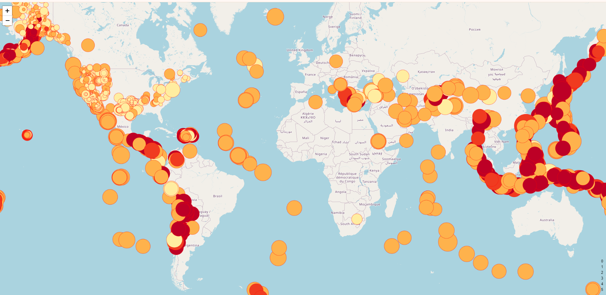

# leaflet-challenge
Module 15 Challenge
 Create a new repository for this project called leaflet-challenge. Do not add this Challenge to an existing repository.

Clone the new repository to your computer.

Inside your local git repository, create a directory for the Leaflet challenge. Use the folder names to correspond to the challenges: Leaflet-Part-1 and Leaflet-Part-2.

This Challenge uses both HTML and JavaScript, so be sure to add all the necessary files. These will be the main files to run for analysis.

Push the above changes to GitHub. Your first task is to visualise an earthquake dataset. Complete the following steps:

Get your dataset. To do so, follow these steps:

The USGS provides earthquake data in a number of different formats, updated every 5 minutes. Visit the USGS GeoJSON FeedLinks to an external site. page and choose a dataset to visualise. The following image is an example screenshot of what appears when you visit this link: When you click a dataset (such as "All Earthquakes from the Past 7 Days"), you will be given a JSON representation of that data. Use the URL of this JSON to pull in the data for the visualisation. The following image is a sampling of earthquake data in JSON format Import and visualise the data by doing the following:

Using Leaflet, create a map that plots all the earthquakes from your dataset based on their longitude and latitude.

Your data markers should reflect the magnitude of the earthquake by their size and the depth of the earthquake by colour. Earthquakes with higher magnitudes should appear larger, and earthquakes with greater depth should appear darker in colour.

Hint: The depth of the earth can be found as the third coordinate for each earthquake.

Include popups that provide additional information about the earthquake when its associated marker is clicked.

Create a legend that will provide context for your map data.

Your visualisation should look something like the preceding map.
ChatGPT
Here's a template for your README file:

markdown
Copy code
# Leaflet Challenge

## Overview
This project visualizes earthquake data using Leaflet, a JavaScript library for interactive maps. The project involves plotting earthquake data based on their longitude and latitude, with data markers reflecting the magnitude of the earthquake by their size and the depth of the earthquake by color. Popups are included to provide additional information about each earthquake when its associated marker is clicked. Additionally, a legend is created to provide context for the map data.

## Repository Structure
The repository is structured as follows:
- **Leaflet-Part-1**: Contains the code for visualizing earthquake data.
- **Leaflet-Part-2**: (Not attempted) 

## Setup
To run the visualization, follow these steps:
1. Clone this repository to your local machine.
2. Navigate to the appropriate directory (`Leaflet-Part-1`) depending on the part of the challenge you want to explore.

## Data Source
The earthquake data used for this visualization is obtained from the USGS GeoJSON Feed. The data is updated every 5 minutes and is available in JSON format.

## Instructions
### Part 1: Visualizing Earthquake Data
1. Visit the [USGS GeoJSON Feed](https://earthquake.usgs.gov/earthquakes/feed/v1.0/geojson.php) page.
2. Choose a dataset to visualize (e.g., "All Earthquakes from the Past 7 Days").
3. Use the URL of the selected JSON dataset to pull in the earthquake data for visualization.
4. Create a map using Leaflet that plots all the earthquakes from the dataset based on their longitude and latitude.
5. Adjust the data markers to reflect the magnitude of the earthquake by their size and the depth of the earthquake by color.
6. Include popups that provide additional information about each earthquake when its associated marker is clicked.
7. Create a legend to provide context for the map data.

## Example
Your visualization should resemble the following map:

## Dependencies
- Leaflet
- d3
- BCS support for the code to work - Courtney helped with code so that the basemap could work
- Used CHATGPT to verify the code

